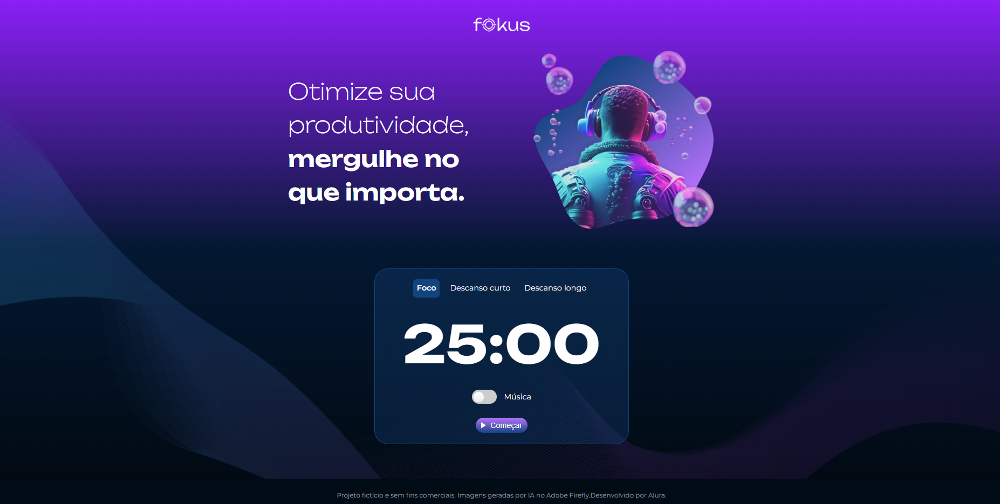
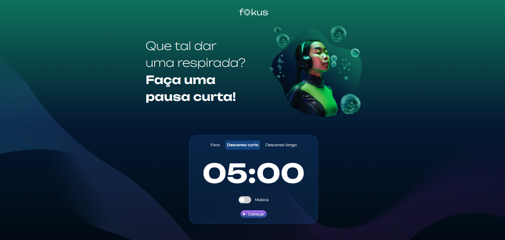
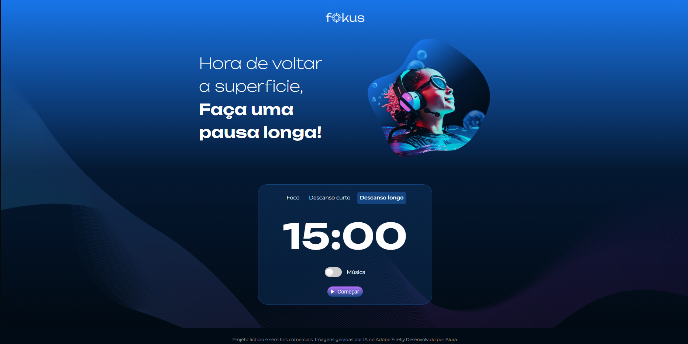

#Fokus

Um projeto com fins de estudo de manipulação de elementos utilizando Document Object Model (DOM)

O projeto fornece uma interface simples e pratica com opções de temporizadores para o usuario focar e ter algum tempo de pause entre os tempos de foco.

 [Acesse o Projeto clicando aqui !](https://fokus-navy.vercel.app)